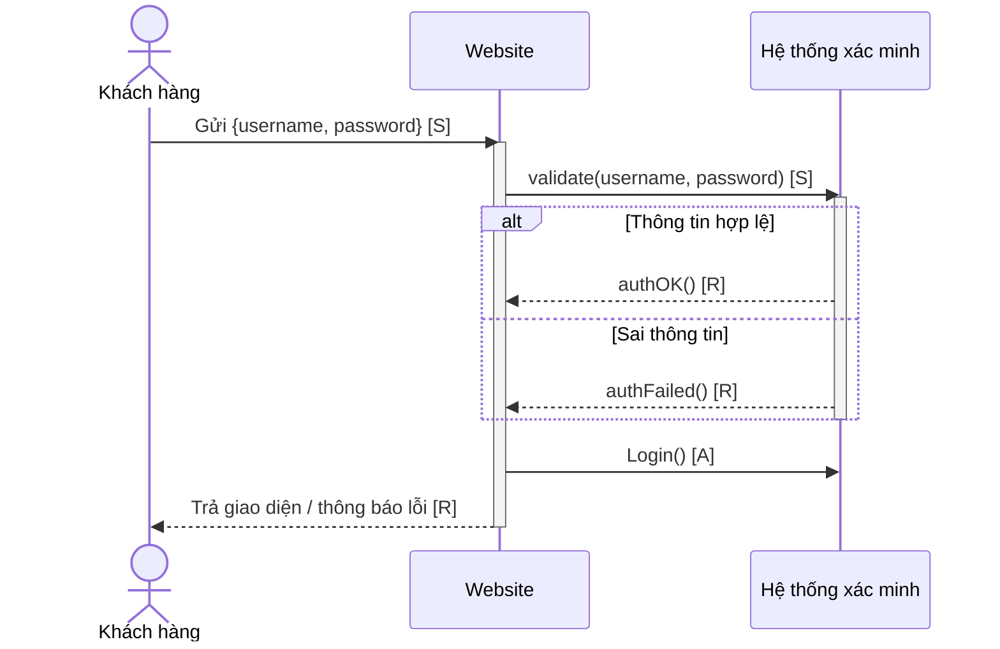

```mermaid
sequenceDiagram
    actor Customer as Khách hàng
    participant Web as Website
    participant Auth as Hệ thống xác minh

    Customer->>Web: Gửi {username, password} [S]
    activate Web

    Web->>Auth: validate(username, password) [S]
    activate Auth


    alt Thông tin hợp lệ
        Auth-->>Web: authOK() [R]
    else Sai thông tin
        Auth-->>Web: authFailed() [R]
    end
    deactivate Auth

    Web->>Auth: Login() [A]

    Web-->>Customer: Trả giao diện / thông báo lỗi [R]
    deactivate Web
```