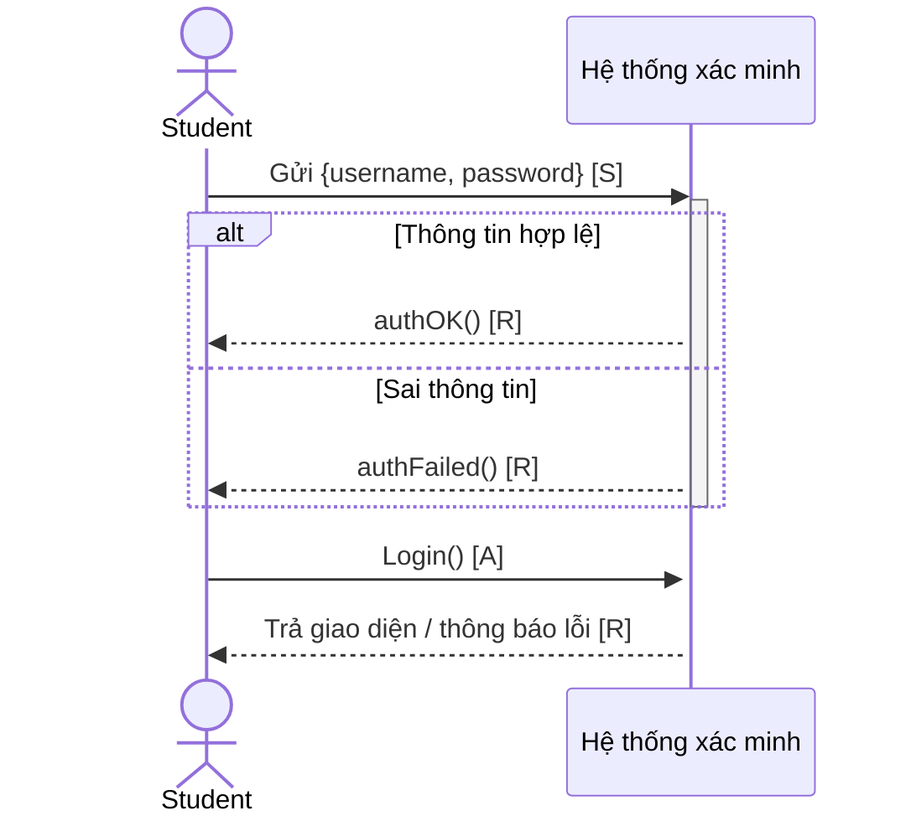

```mermaid
sequenceDiagram
    actor Customer as Student
    participant Auth as Hệ thống xác minh

    Customer->>Auth: Gửi {username, password} [S]
    activate Auth

    activate Auth


    alt Thông tin hợp lệ
        Auth-->>Customer: authOK() [R]
    else Sai thông tin
        Auth-->>Customer: authFailed() [R]
    end
    deactivate Auth

    Customer->>Auth: Login() [A]

    Auth-->>Customer: Trả giao diện / thông báo lỗi [R]
```