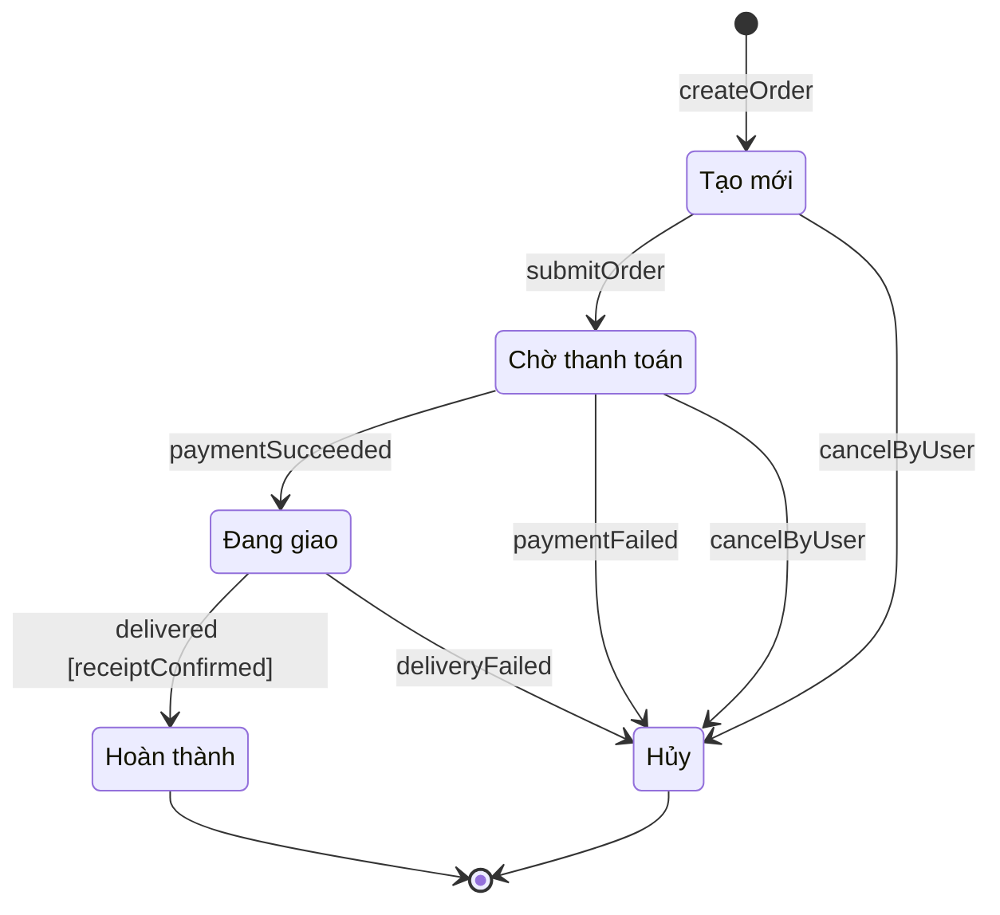

```mermaid
stateDiagram-v2

  state "Tạo mới" as TaoMoi
  state "Chờ thanh toán" as ChoThanhToan
  state "Đang giao" as DangGiao
  state "Hoàn thành" as HoanThanh
  state "Hủy" as Huy
  
  [*] --> TaoMoi : createOrder
  TaoMoi --> ChoThanhToan : submitOrder
  ChoThanhToan --> DangGiao : paymentSucceeded
  ChoThanhToan --> Huy : paymentFailed
  ChoThanhToan --> Huy : cancelByUser
  DangGiao --> HoanThanh : delivered [receiptConfirmed]
  DangGiao --> Huy : deliveryFailed
  TaoMoi --> Huy : cancelByUser
  HoanThanh --> [*]
  Huy --> [*]
```